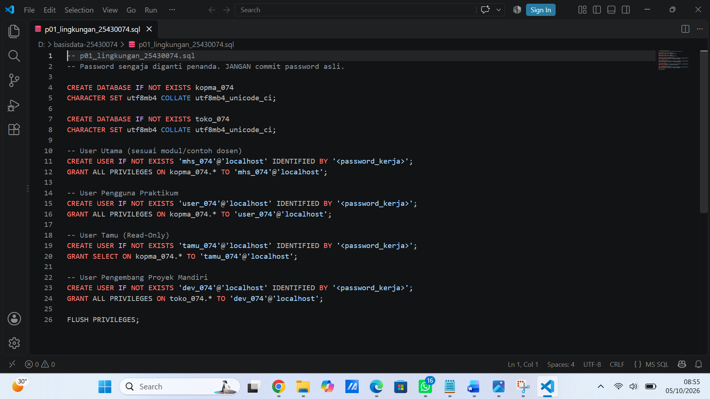
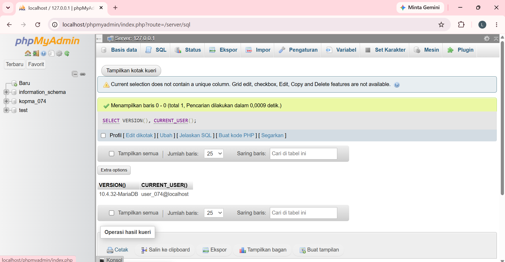
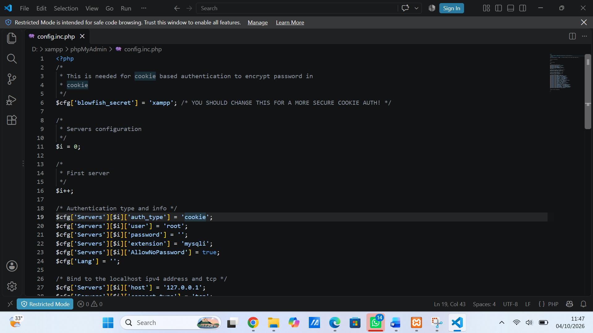
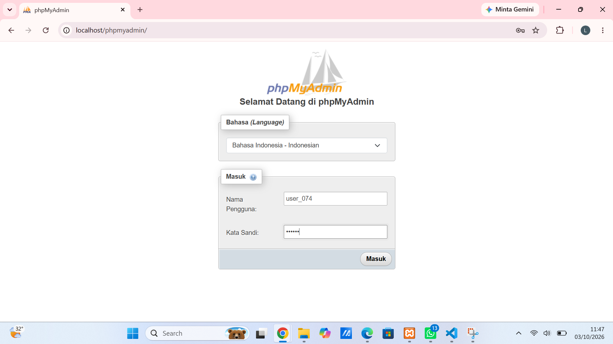
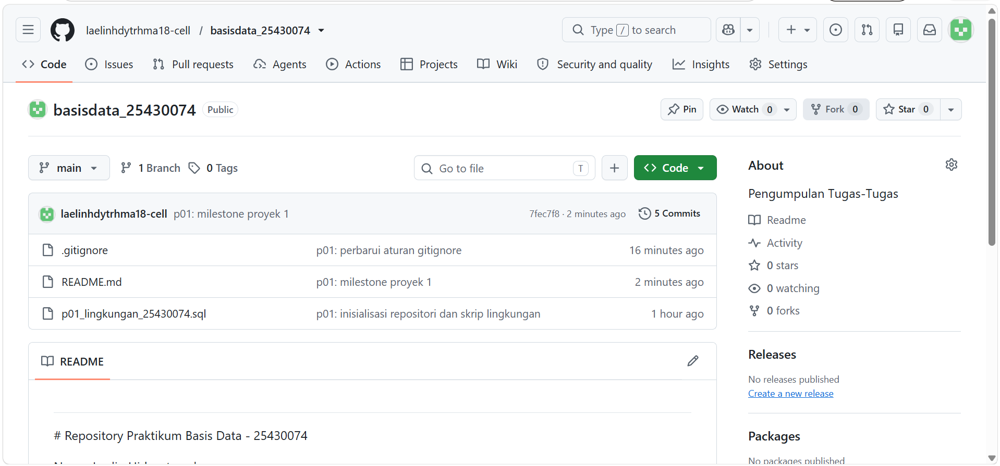
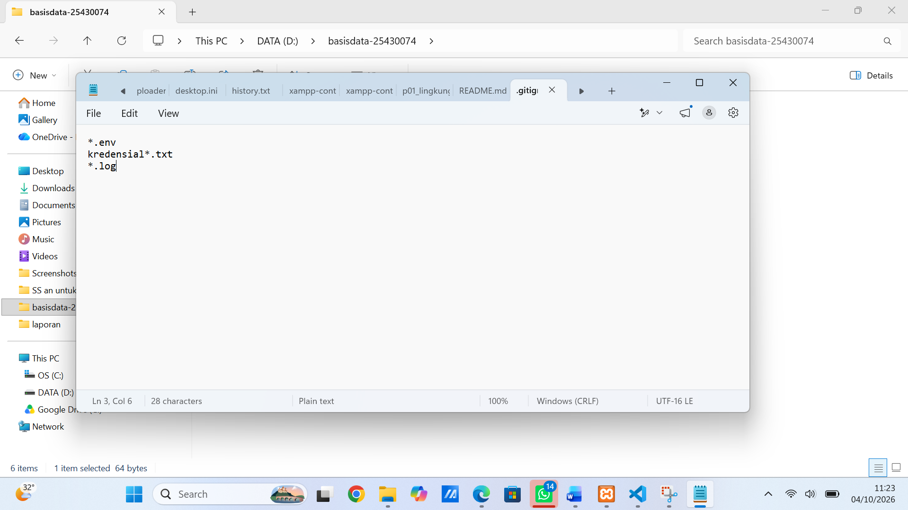

# LAPORAN PRAKTIKUM MODUL 1

#### Identitas Mahasiswa

Nama: Laelin Hidayaturrohma

NPM: 25430074

Kelas: C

Mata Kuliah: Basis Data

Dosen Pengampu: Dedi Irawan, S.Kom, M.T.I

Program Studi: Ilmu Komputer

Fakultas: Ilmu Komputer

Instansi: Universitas Muhammadiyah Metro (2026)

## 1. Tujuan Praktikum

1. Memasang dan mengonfigurasi database MySQL/MariaDB di perangkat kerja.
2. Terhubung ke server MariaDB lewat Command Line (CLI) maupun web browser via phpMyAdmin, sekaligus memahami perbedaan pengggunaan keduanya.
3. Membuat database baru, menambah akun pengguna (user), serta mengatur hak akses (privileges) sesuai kebutuhan.
4. Memakai Git dan GitHub untuk mengelola repositori serta menyimpan berkas skrip SQL yang dibuat.
5. Menyusun informasi proyek pada berkas README.md dan mengamankan berkas sensitive menggunakan .gitignore.

## 2. Alat dan Bahan

1. PC/Laptop OS Windows 10/11 64-bit.
2. Aplikasi XAMPP versi 8.2.12 (di dalamnya terpasang MariaDB 10.4.32 dan phpMyAdmin 5.2.1).
3. Git for Windows serta akun pribadi di platform GitHub.
4. Peramban web (browser) untuk membuka alamat http.//localhost/phpMyAdmin.

## 3. Dasar Teori

Basis data adalah sekumpulan informasi yang dikelompokkan secara terstruktur di dalam komputer. Data tersebut dikelola menggunakan perangkat lunak khusus yang dinamakan Database Management System (DBMS). Salah satu DBMS open-source yang sangat popular digunakan saat ini adlaah MySQL/MariaDB. Agar data di dalamnya tetap aman, DBMS menerapkan Data Control Language (DCL) untuk membatasi hak akses tiap pengguna sesuai perannya.

Selain mengurus database, seorang pengembang juga perlu menguasai Version Control System seperti Git. Dengan Git, kita bisa mencatat Riwayat perubahan kode SQL, berkolaborasi lewawt platform seperti GitHub, dan mencegah berkas berisi kredensial atau password rahasia agar tidak ikut terunggah dengan memanfaatkan aturan pada file .gitignore.

## 4. Langkah Kerja dan Hasil Praktikum

1. Memulai Service MySQL dan Apache:
* Langkah awal yang saya lakukan adalah membuka aplikasi XAMPP Control Panel.
* Kemudian, klik tombol Start pada modul Apache dan MySQL.
* Keduanya sudah dinyatakan berjalan normal setelah indicator nama berubah warna menjadi hijau, lengkap dengan munculnya nilai PID serta Port (Port 80 \& 443 untuk Apache, Port 3306 untuk MySQL).

2. Inisialisasi Repositori Git dan Folder Proyek
* Saya membuat folder baru di komputer bernama basisdata-25430074.
* Folder ini lalu diinisialisasi sebagai repositori Git local dan dihubungkan ke GitHub dengan nama repositori basisdata_25430074 di Bawah akun laelinhdytrhma18-cell.

3. Membuat Skrip SQL (p01_lingkungan_25430074_sql)

* Selanjutnya, saya menyiapkan skrip SQL untuk membuat database awal dan beberapa akun pengguna.
* Di dalam skrip ini, dibuat database toko_074 dengan encoding utf8mb4, lalu dibuat user dev_074 yang diberikan hak akses penuh khusus ke database toko_074.
* Demi keamanan, kata sandi asli di dalam berkas tidak ditulis langsung, melainkan diganti teks penanda <password\_kerja>.

4. Menyiapkan Keamanan Kredensial (.gitignore)

* Agar berkas rahasia (seperti file konfigurasi, kunci lingkungan, atau file teks yang menyimpan kata sandi) tidak sengaja terunggah ke repositori terbuka, saya membuat file .gitignore.
* Dalam berkas ini, ditambahkan pola percobaan file yang perlu diabaikan oleh Git, misalnya *.env, kredensial*.txt, dan *.log.

5. Menyusun Identitas Proyek (README.md)

* Berkas README.md diperbarui sebagai panduan dan pencatatan identitas proyek mandiri yang dikembangkan selama perkuliahan.
* Tema proyek yang saya pilih berdasarkan akhiran NPM adalah toko_074 dengan nama usaha "Laelin Scrunchie \& Hair Accessories"

6. Mengunggah Kode ke GitHub (git push)

* Setelah semua file siap, saya melakukan penambahan berkas, pembuatan commit, lalu mendorong (push) seluruh file tersebut ke repositori utama di GitHub.

## 5. Hasil Langkah Percobaan

Berikut adalah penjelasan dan tangkapan layer/screenshot saat menjalankan perintah di terminal maupun phpMyAdmin

SELECT VERISON(), CURRENT_USER();

Perintah ini digunakan untuk  mengecek versi server MariaDB dan user yang sedang aktif.

SELECT @@sql_mode;

Menampilkan konfigurasi mode operasi SQL yang aktif pada server MariaDB.

SHOW DATABASE;

Akses sebagai 'root': Menampilkan seluruh baris data sistem (informasi_schema, MySQL, performance_schema, phpMyAdmin, sys, kopma_074, toko_074).

Akses sebagai 'mhs_074': Menampilkan information_schema, test, dan kopma_074.

Akses sebagai 'dev_074': Menampilkan information_schema, test, dan toko_074.

Uji Coba Galat (ERROR 1044, 1045, dan 1142):

ERROR 1045: Terjadi saat gagal otentikasi login (misalnya tanpa '-p' atau password salah.

ERROR 1044: Terjadi Ketika user berhasil login tetapi tidak memiliki izin untuk mengakses basis data tertentu (missal 'dev_074' menjalankan 'USEkopma_074;')

Halaman Masuk phpMyAdmin Mode Cookie:

Pengujian halaman login phpMyAdmin dengan pengaturan 'auth_type = cookie' pada berkas 'config.inc.php', yang memerlukan otentikasi pengguna dan kata sandi demi keamanan.

Perintah 'git push' Pertama ke GitHub:

Proses menghubungkan repositori local ke 'remote' origin GitHub 'https://github.com/laelinhdytrhma18-cell/basisdata_25430074.git' dan melakukan pengunggahan berkas pertama kali.

## 6. Jawaban Titik Analisis

1. Titik Analisis 1: Dampak Penggunaan MySQL vs MariaDB

Meskipun sering dianggap sama, menggunakan penamaan "MySQL" pada system MariaDB bisa menampilkan perbedaan saat mencari solusi masalah secara online. Dokumentasi MySQL masih oke untuk perintah dasar (ANSI SQL standar), namun untuk fitur bawaan MariaDB versi 10.x+, pilihan mesin penyimpanan tertentu, dan manajemen hak akses pengguna, kita tetap wajib mengarah ke dokumentasi resmi MariaDB.

2. Titik Analisis 2: Memahami Pesan Kesalahan Log In (ERROR 1045)

Saat mencoba masuk ke database tanpa parameter -p, muncul balasan pesan kesalahan ERROR 1045. Letak perbedaan utamanya ada pada (using passoword: NO), yang menandakan bahwa sistem mendeteksi kita mencoba masuk tanpa mengirimkan kata sandi sama sekali. Berbeda halnya jika kita memasukkan password tapi salah, pesan yang keluar akan berisi (using password: YES).

3. Titik Analisis 3: Akses Schema Sistem & Beda ERROR 1044 vs ERROR 1045

Database information_schema masih bisa dibuka oleh user biasa karena isinya hanya berupa metadata struktur database (bersifat read-only). Sebaliknya, database mysql langsung ditolak karena menyimpan informasi kredensial sensitive pengguna.

Mengenai kodenya: ERROR 1045 terjadi di awal saat proses login gagal akibat kendala otentikasi. Sedangkan ERROR 1044 muncul setelah kita berhasil login, tapi akun yang digunakan tidak punya wewenang untuk masuk atau mengelola database tertentu yang dipanggil.

4. Titik Analisis 4: Keamanan Otentikasi phpMyAdmin (Cookie vs Config)

Metode autentikasi cookie jauh lebih aman daripada metode config. Jika memakai config, kata sandi disimpan mentah di dalam berkas config.inc.php di server. Sementara dengan metode cookie, pengguna diwajibkan mengetikkan username dan password lewat halaman login. Informasi tersebut nantinya disimpan sebagai cookie terenkripsi sementara yang akan terhapus otomatis bagitu sesi berakhir.

## 7. Hasil Latihan dan Modifikasi

Pembuatan Akun Tamu (tamu_074): Dibuat akun 'tamu_074' dengan hak akses 'SELECT'-only pada basis data koperasi (kopma_074).

Penyesuaian Skrip SQL: Skrip disesuaikan aggar dapat dijalankan berulang kali tanpa bentrok/error dengan menggunakan klausa 'IF NOT EXISTS' pada perintah 'CREATE DATABASE' dan 'CREATE USER'.

## 8. Tugas Mandiri: Milestone Proyek 1

Pembuatan Basis Data Proyek 'toko_074':

Basis data dibuat khusus untuk proyek mandiri berakhiran NPM 74 dengan *character set* 'utf8mb4'dan *collation* 'utf8mb4_unicode_ci'.

Pembuatan Akun Pengembang 'dev_074':

Dibuat akun 'dev_074' yang diberikan hak akses penuh (ALL PRIVILEGES) khusus pada basis data proyek 'toko_074'.

Dokumentasi Keamanan Repositori:

Penambahan identitas proyek mandiri "Laelin Scrunchie \& Hair Accessories)" pada berkas 'README.md' serta pembuatan berkas '.gitignore' untuk mengabaikan berkas sensitif seperti '.env', 'kredensial*.txt', dan '*.log'.

## 9. Kesimpulan

Pada Praktikum Modul 1 ini, seluruh rangkaian inisialisasi lingkungan basis data dan integrasi control versi telah berhasil dilaksanakan 100%. Basis data 'toko_074' dan pengguna 'dev_074' telah berhasil dikonfigurasi dengan aman menggunakan skrip SQL terstruktur. Dokumentasi proyek mandiri bertema "Laelin Scrunchie & Hair Accessories" telah tercatat pada 'README.md' dan seluruh berkas telah tersinkronisasi di repositori GitHub.

## 10. Pernyataan Penggunaan AI

Alat bantu AI digunakan untuk memverifikasi sintaks perintah SQL (DDL dan DML), serta panduan penyinkronan repositori GitHub. Semua konfigurasi XAMPP, eksesusi query di CLI MariaDB, dan penanganan kode galat.

## 11. Bukti Git

Tautan Repositori: 'https://github.com/laelinhdytrhma18-cell/basisdata_25430074'

Hash Commit:

* 288c731880c0cd3301091b56a7079791831ca7d9
* 80cfc901a24b37350d7a2fca20b0963ec48eb401
* be47cef27622cb9cb533571335a92ba480c27563

## Checklist Verifikasi Mandiri Modul 1

- [x] Berkas skrip SQL `p01_lingkungan_25430074.sql` lengkap dengan pembuatan database `toko_074` dan user `dev_074`
- [x] Berkas `README.md` berisikan identitas proyek mandiri "Laelin Scrunchie & Hair Accessories" dan berkas `.gitignore` sudah terkonfigurasi
- [x] Tangkapan layar langkah percobaan lengkap tersimpan di folder `laporan/img/` (Pemeriksaan versi, `SHOW DATABASES;`, galat 1044/1045/1142, phpMyAdmin Cookie, dan `git push`)
- [x] Jawaban Titik Analisis 1 hingga 4 (Dampak MariaDB vs MySQL, Pesan Galat 1045, Schema Sistem vs Galat 1044, serta Keamanan Cookie vs Config) telah diisi lengkap
- [x] Seluruh tautan repositori GitHub dan commit hash sudah dicantumkan dengan benar