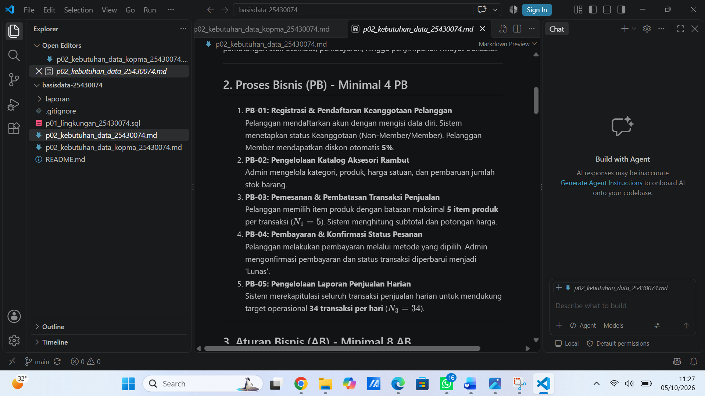
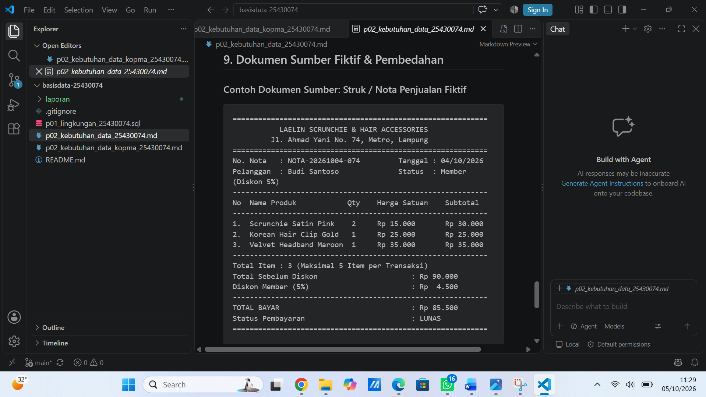
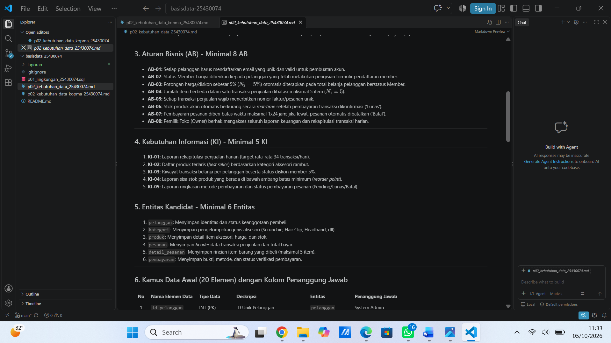
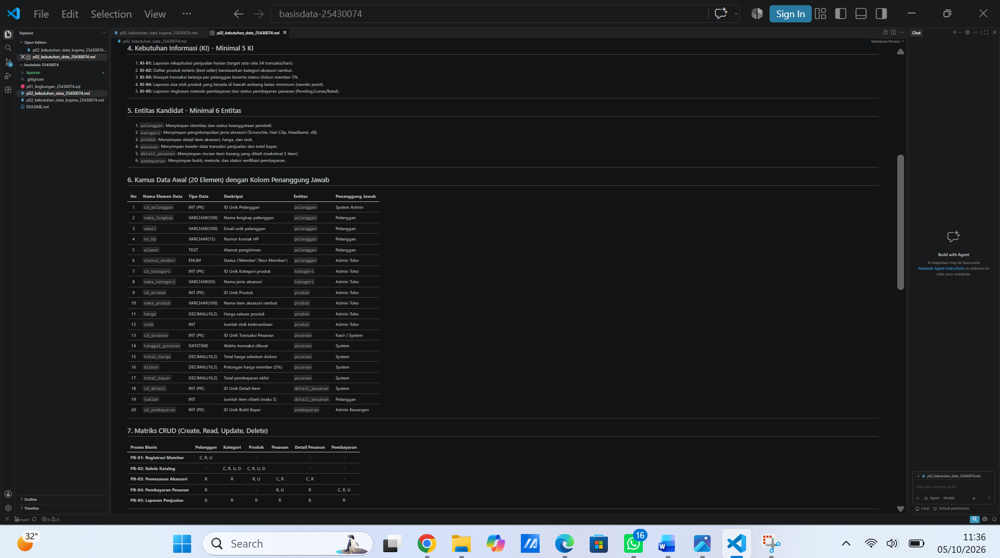
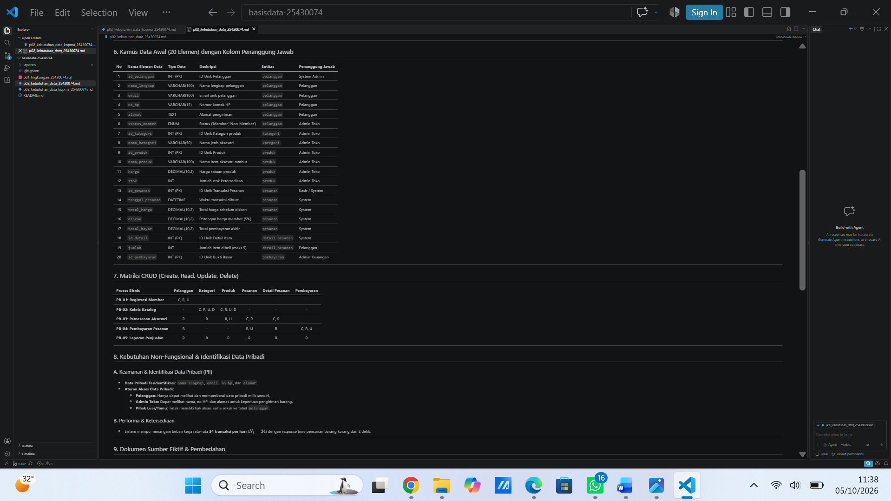
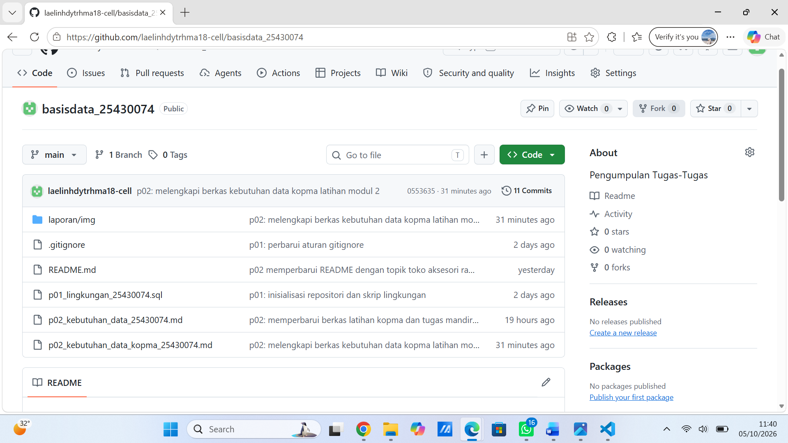

# Laporan Praktikum Basis Data Modul 02

#### Identitas Mahasiswa

Nama: Laelin Hidayaturrohma

NPM: 25430074

Kelas: C

Mata Kuliah: Basis Data

Dosen Pengampu: Dedi Irawan, S.Kom, M.T.I

Program Studi: Ilmu Komputer

Fakultas: Ilmu Komputer

Instansi: Universitas Muhammadiyah Metro (2026)

## 1. Tujuan Praktikum

1. mengidentifikasi aktivitas organisasi, aktor, dan proses bisnis dari narasi, 
wawancara, dan dokumen sumber;
2. menurunkan elemen data, entitas kandidat, dan aturan bisnis dari dokumen 
sumber;
3. menyusun matriks proses data (CRUD) dan kamus data awal yang 
mencantumkan penanggung jawab data;
4. menulis pernyataan kebutuhan data dan kebutuhan informasi yang jelas serta bisa diuji.

## 2. Alat dan Bahan

- Narasi studi kasus Kopma, kutipan wawancara, dan nota penjualan di modul ini.
- Editor teks untuk menulis berkas Markdown (.md), seperti Visual Studio Code.
- Repositori basisdata-<NPM> dari Modul 1.
- Tidak perlu XAMPP; modul ini sepenuhnya untuk analisis kerja.

## 3. Ringkasan Dasar Teori

Analisis kebutuhan adalah langkah pertama yang sangat penting dalam merancang basis data. Jika terjadi kesalahan pada tahap ini, biayanya akan menjadi paling mahal untuk diperbaiki pada tahap berikutnya. Ada empat kategori kebutuhan yang harus dijelaskan: kebutuhan data, kebutuhan informasi, aturan bisnis, dan kebutuhan non-fungsional. 

Matriks CRUD berfungsi sebagai alat pemeriksa kelengkapan. Alat ini memastikan setiap entitas mempunyai proses yang membuat datanya. Hal ini mencegah dan mendeteksi proses bisnis yang terlewat. Selain itu, pernyataan kebutuhan non-fungsional harus memenuhi kriteria spesifik. Dengan demikian kebutuhan tersebut dapat diuji secara tujuan saat validasi sistem.

## 4. Hasil Langkah Percobaan

Dokumen lengkap hasil langkah percobaan berada di berkas `p02_kebutuhan_data_kopma_25430074.md`. Berkas ini sudah memuat integrasi hasil Latihan E.1 di seluruh bagian serta Latihan E.2 di bagian akhir dokumen.

| Langkah | Hasil | Tangkapan layar |
|---|---|---|
| D.2 Aktor dan proses bisnis | Tabel PB-01 sampai PB-06 (PB-06 penukaran poin loyalitas) |  |
| D.3 Dokumen sumber | Pembedahan Nota Penjualan PJ-2609-0142 |  |
| D.4 Entitas dan aturan bisnis | 8 entitas kandidat, AB-01 sampai AB-09 (termasuk poin loyalitas) |  |
| D.5 Kebutuhan informasi dan CRUD | KI-01 sampai KI-05, matriks CRUD 6 proses x 7 entitas |  |
| D.6 Kamus data | 20+ elemen data utama beserta penanggung jawab & non-fungsional |  |
| D.7 Dokumen di repositori | Berkas di-commit dengan pesan `p02: dokumen kebutuhan data kopma` |  |

## 5. Jawaban Titik Analisis

Titik Analisis 1 - Mengapa nota menyimpan harga saat transaksi
Harga di tabel katalog barang selalu menunjukkan harga terbaru. Jika nota penjualan hanya mengacu pada harga di tabel katalog barang, setiap kenaikan harga akan membuat nilai transaksi pada nota lama ikut naik. Ini membuat laporan keuangan masa lalu menjadi tidak jelas dan bisa membingungkan pengurus. Dengan menyimpan `harga_satuan_detail_penjualan` secara tetap di setiap baris nota (sesuai AB-04), nilai historis transaksi yang benar-benar dibayar pembeli tetap terjaga.

Titik Analisis 2 - Subtotal dan total sebagai nilai turunan
- Alasan tidak disimpan, nilai subtotal dan total adalah hasil hitung dari perkalian kuantitas, harga satuan, dan diskon. Tidak menyimpan nilai ini menghindari data ganda dan resiko perbedaan nilai jika ada pembaruan rincian item.

- Alasan ini mungkin tetap disimpan. Tujuannya agar proses pembuatan laporan omzet harian atau bulanan bisa lebih cepat tanpa harus menjalankan aggregate query berulang kali pada ribuan baris rincian transaksi. Selain itu, data ini menjadi bukti nilai akhir transaksi lunas yang tidak akan berubah meskipun rumus perhitungan diubah di masa depan.

Titik Analisis 3 - Kolom Pemasok dan status aktif anggota
Tidak adanya huruf C (Create) pada entitas Pemasok menunjukkan bahwa sistem belum mempunyai proses bisnis untuk mendaftarkan data pemasok baru. Padahal, proses pemesanan dan penerimaan barang membacanya (R). Karena itu, perlu ada proses bisnis baru yaitu "Mengelola Data Pemasok" (PB oleh Petugas Gudang). Hal yang sama juga berlaku pada entitas barang dan status anggota. Diperlukan proses "Perbarui Status Anggota" oleh Ketua Koperasi supaya data bisa di-update sesuai aturan bisnis AB-02.

## 6. Hasil Latihan dan Modifikasi

### E.1 Poin Loyalitas
Setiap pembelian belanja Rp10.000 oleh anggota aktif mendapat 1 poin. Jika sudah mengumpulkan 50 poin, poin tersebut bisa ditukar dengan potongan belanja Rp5.000.

Aturan Bisnis Tambahan:
- AB-07: Setiap pembelian belanja Rp10.000, anggota aktif mendapat 1 poin loyalitas.
- AB-08: Poin loyalitas bisa dikumpulkan dan tidak punya massa kedaluwarsa selama status keanggotaan masih aktif.
- AB-09: Setiap kelipatan 50 poin loyalitas bisa ditukar dengan potongan harga Rp5.000 pada transaksi berikutnya.

Kebutuhan Informasi Tambahan:
- KI-05: Laporan tentang riwayat perolehan dan penukaran poin loyalitas untuk setiap anggota.

### E.2 Perbaikan Tiga Pernyataan Kebutuhan Kabur

(a) "Data anggota harus aman"
Perbaikan: Sistem harus mengenkripsi kata sandi anggota dengan algoritma BCRYPT. Sistem juga menerapkan kontrol akses berbasis peran, jadi hanya Ketua Koperasi yang dapat melihat nomor kontak HP jika terjadi 3 kali kegagalan login berturut-turut, akun akan terkunci secara otomatis.

(b) "Sistem harus cepat mencari barang"
Perbaikan: Sistem harus menampilkan hasil pencarian barang berdasarkan nama atau kode barang. Waktu respon harus kurang dari 1,5 detik pada beban puncak 100 pengguna bersamaan.

(c) "Laporan stok harus akurat"
Perbaikan: Sistem harus langsung memperbarui jumlah stok barang setelah transaksi dibayar lunas. Toleransi selisih antara stok fisik dan sistem adalah 0%.

## 7. Tugas Mandiri: Milestone Proyek 2

Berkas: `p02_kebutuhan_data_25430074.md` (Organisasi Fiktif: **Laelin Scrunchie & Hair Accessories** / `toko_74`).

| Ketentuan minimum | Target | Hasil |
|---|---|---|
| Proses bisnis | >= 4 | 5 (PB-01 sampai PB-05) |
| Entitas kandidat | >= 6 | 6 (`pelanggan`, `kategori`, `produk`, `pesanan`, `detail_pesanan`, `pembayaran`) |
| Aturan bisnis | >= 8 | 8 (AB-01 sampai AB-08) |
| Kebutuhan informasi | >= 5 | 5 (KI-01 sampai KI-05) |
| Matriks CRUD | Semua entitas punya C | Terpenuhi, tanpa entitas yatim |
| Kamus data | >= 20 elemen, ada penanggung jawab | 20 elemen data lengkap beserta penanggung jawab |
| Kebutuhan non-fungsional | Data pribadi & hak akses | Volume transaksi, masa retensi, dan matriks hak akses PII |
| Dokumen sumber fiktif | >= 1 beserta pembedahan | Struk / Nota Pembelian Fiktif *Laelin Scrunchie* |
| Parameter P | Perhitungan di Bagian 9 | Terpenuhi ($P = 3$) |

**Perhitungan Parameter P (NPM 25430074):**
- Dua digit terakhir NPM ($NPM = 74$).
- $N_1 = 74 \pmod 9 + 1 = 2 + 1 = \mathbf{3}$.
- Batas maksimal pembelian produk per transaksi = $N_1 + 2 = 3 + 2 = \mathbf{5}$ item.
- Persentase diskon member terdaftar = $N_1 + 2 = \mathbf{5\%}$.

## 8. Pembahasan dan Kendala

Selama pelaksanaan praktikum Modul 2, masalah utama yang muncul adalah memastikan matriks CRUD terpetakan dengan benar tanpa ada entitas yang tidak memiliki operasi "Create". Saat memeriksa skenario awal, ditemukan entitas Pemasok yang hanya dibaca dan datanya tidak pernah dibuat. Dari situ, muncul pemahaman baru tentang pentingnya menelusuri kembali aturan bisnis kr proses bisnis agar seluruh siklus hidup data bisa terakomodasi dengan baik.

## 9. Kesimpulan

Analisis kebutuhan data yang terstruktur berhasil menurunkan entitas kandidat, aturan bisnis, dan kebutuhan informasi yang konsisten dari narasi organisasi.
Matriks CRUD terbukti efektif untuk menemukan proses bisnis yang belum terdefinisi. Matriks ini juga membantu mencegah munculnya entitas yatim dalam sistem.
Penentuan parameter $P = 3$ berdasarkan digit NPM 74 berhasil diterapkan pada Aturan Bisnis pembatasan transaksi toko "Laelin Scrunchie".

## 10. Pernyataan Penggunaan AI

Alat bantu AI digunakan untuk memeriksa apakah kriteria penulisan kebutuhan non-fungsional sudah lengkap dan bisa diuji. Alat ini juga membantu mengubah matriks CRUD ke tabel Markdown. Semua aturan bisnis, perhitungan variabel NPM, dan penyesuaian domain toko aksesori sudah dicek dan disesuaikan sendiri.

## 11. Bukti Git

- Repositori: `https://github.com/laelinhdytrhma18-cell/basisdata_25430074`
- Hash commit `p02: dokumen kebutuhan data kopma`: `0553635265a49d62f35c72613ce4a64786229319`
- Hash commit milestone proyek (`p02_kebutuhan_data_25430074.md`): `5d5de16eefc8f886a702392eaac0ed9d2312589a`

## Checklist

- [x] Parameter $N_1$, $N_2$, $N_3$ telah dihitung sesuai akhiran NPM 74 ($N_1 = 5$, $N_2 = 5\%$, $N_3 = 34$)
- [x] Penjelasan minimal 4 Proses Bisnis (PB-01 hingga PB-05) tercantum lengkap
- [x] Tabel Entitas Candidates dan Aturan Bisnis terformat rapi sesuai standar
- [x] Tabel Kebutuhan Informasi (KI) serta Matriks CRUD terdefinisi dengan tepat
- [x] 6 Bukti tangkapan layar (`p02_pb.png`, `p02_ab.png`, `p02_crud.png`, `p02_penambahan_berkass.png`, `p02_laporan.png`, dan `p02_github.png`) tersimpan di `laporan/img/`
- [x] Analisis Titik Kritis 1 hingga 4 (Batasan Transaksi $N_1$, Skalabilitas Harian $N_3$, Dampak $N_2$, dan Matriks CRUD) diisi lengkap
- [x] Repositori Git bersih (*clean workspace*) dan seluruh perubahan telah berhasil di-*push* ke GitHub